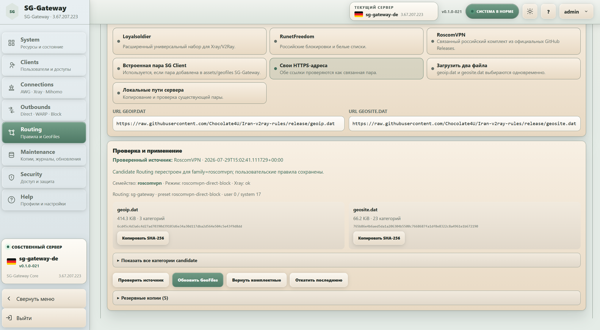
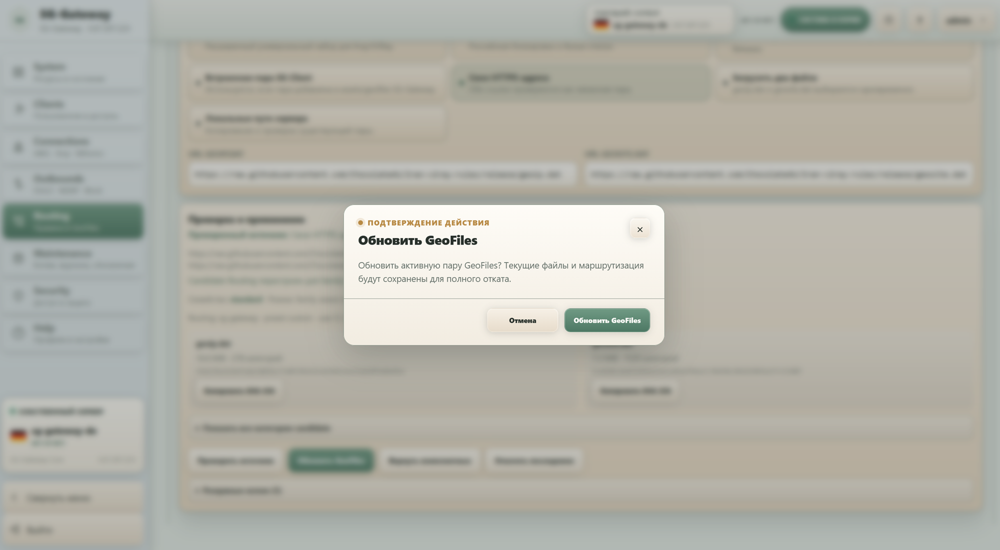
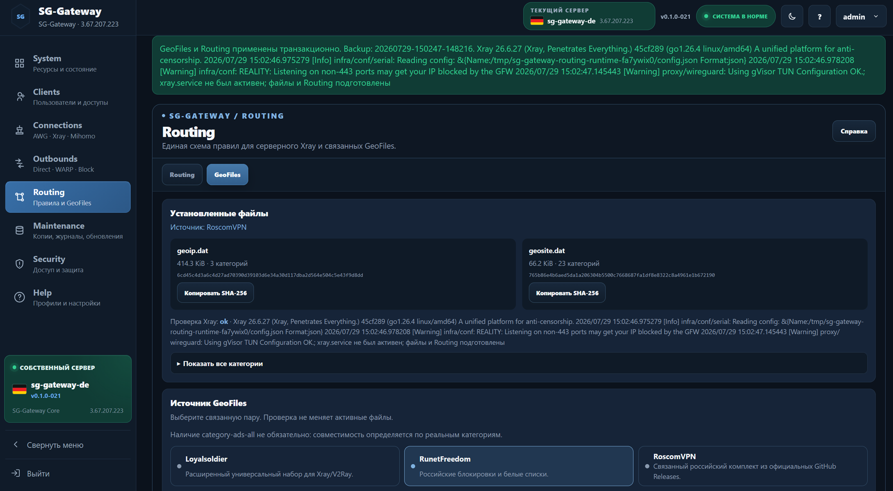

# Routing и GeoFiles

## Действия

SG-Gateway использует три реальных действия:

- `Direct`;
- `WARP`;
- `Block`.

## Базовые схемы

Панель предлагает готовые основы и пользовательский режим. Ручное изменение переводит схему в пользовательское состояние.

## Российская маршрутизация

Можно выбрать набор доменных категорий или сайты и IP, затем назначить `Direct`, `WARP` или `Block`.

## Простое обновление GeoFiles

В обычной работе GeoFiles обновляются прямо из панели. Вручную скачивать, копировать или заменять `geoip.dat` и `geosite.dat` на сервере не нужно.

### 1. Выберите источник и нажмите «Проверить источник»

Откройте **Routing → GeoFiles**, выберите нужный источник и укажите параметры, если они требуются. Для **Своего HTTPS-адреса** достаточно вставить ссылки на `geoip.dat` и `geosite.dat`. Затем нажмите **«Проверить источник»**.

Проверка не меняет рабочие GeoFiles. После успешной проверки выбранный источник и его параметры остаются на экране, а ниже появляется проверенная пара, готовая к применению.



### 2. Нажмите «Обновить GeoFiles»

После успешной проверки нажмите **«Обновить GeoFiles»**. SG-Gateway покажет короткое подтверждение. Нажмите **«Обновить GeoFiles»** ещё раз.



### 3. Готово

После успешного применения панель показывает уже установленную пару GeoFiles, её источник, размеры, количество категорий и контрольные суммы. Xray и Routing к этому моменту уже проверены.



Для пользователя весь процесс сводится к трём действиям:

**выбрать источник → Проверить источник → Обновить GeoFiles**.

## Что SG-Gateway делает сам

За простыми двумя кнопками остаётся полный безопасный цикл:

1. новая пара `geoip.dat` + `geosite.dat` готовится отдельно от рабочих файлов;
2. читаются реальные protobuf-категории и определяется семейство GeoFiles;
3. системная часть Routing строится заново под новую пару;
4. пользовательские правила сохраняются без автоматического удаления или переписывания;
5. если пользовательское правило требует отсутствующую категорию, обновление блокируется с указанием правила и категории;
6. строится полный будущий Xray config и выполняется `xray run -test`;
7. создаётся резервная копия текущих GeoFiles и связанного Routing;
8. рабочая пара переключается атомарно;
9. Xray проверяется после переключения;
10. при ошибке выполняется rollback.

Поэтому обычное обновление для пользователя выглядит просто:

**выбрать источник → Проверить источник → Обновить GeoFiles**.

## Связанная пара

GeoFiles всегда применяются только вместе:

```text
geoip.dat
geosite.dat
```

Нельзя обновлять один файл отдельно от второго.

## Пользовательские правила

Пользовательские правила принадлежат пользователю. SG-Gateway не удаляет их молча при смене семейства GeoFiles. Если новая пара несовместима с конкретным правилом, применение останавливается до исправления правила или выбора совместимого источника.
