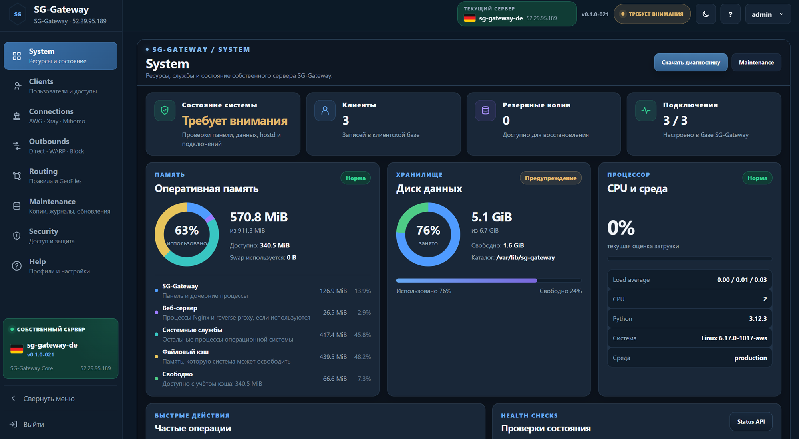
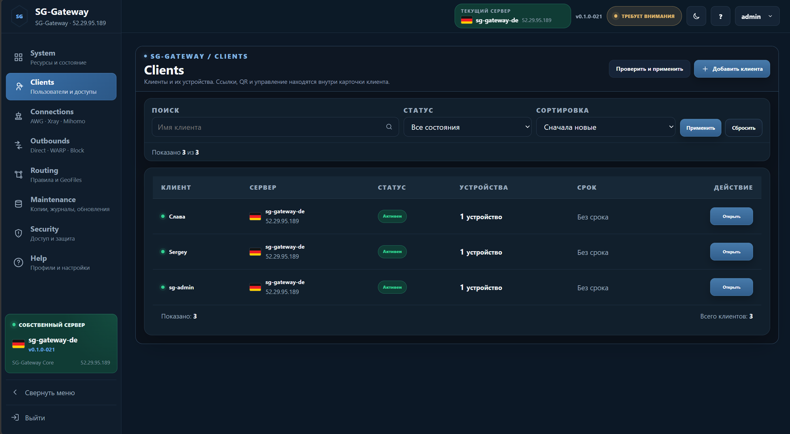
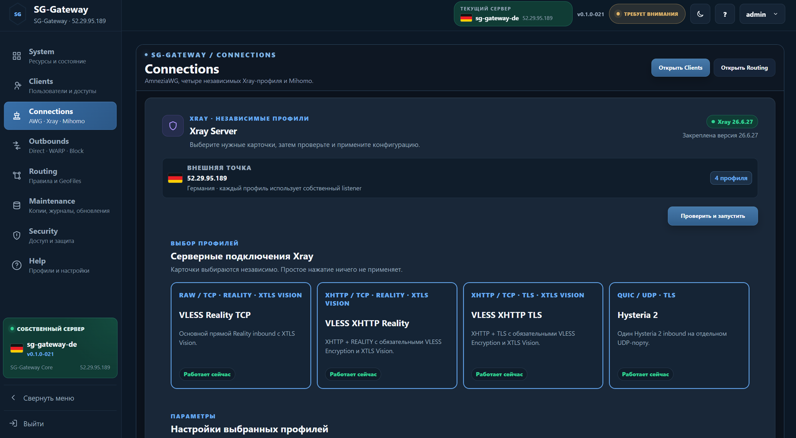
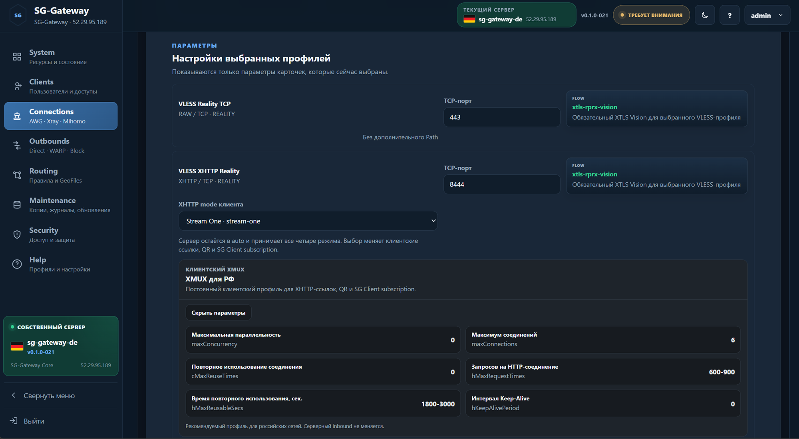
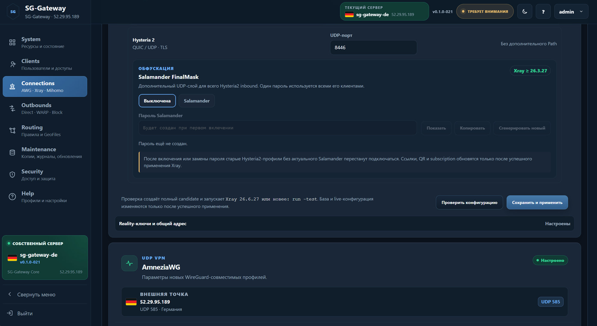
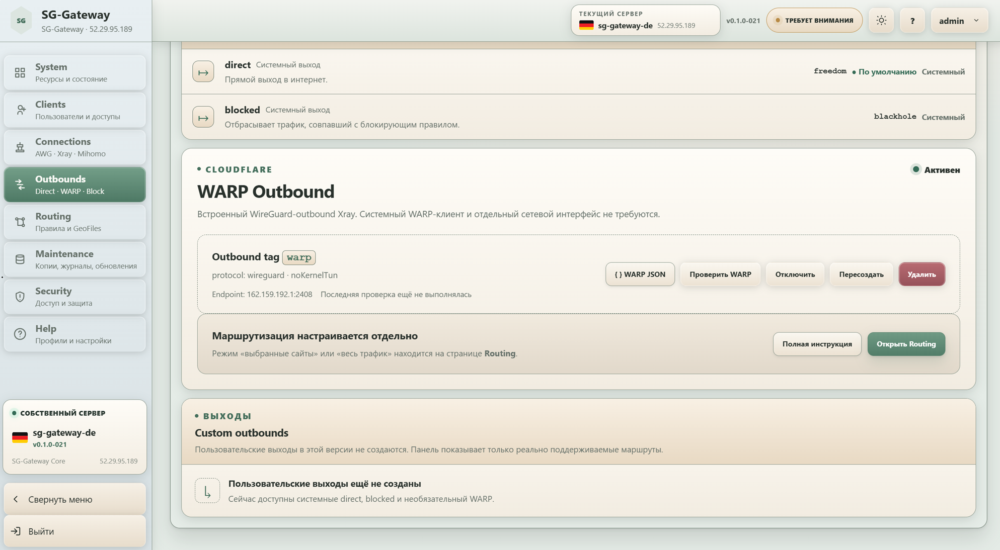
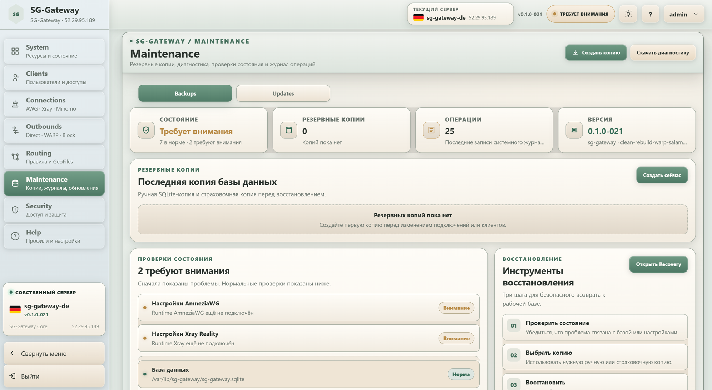
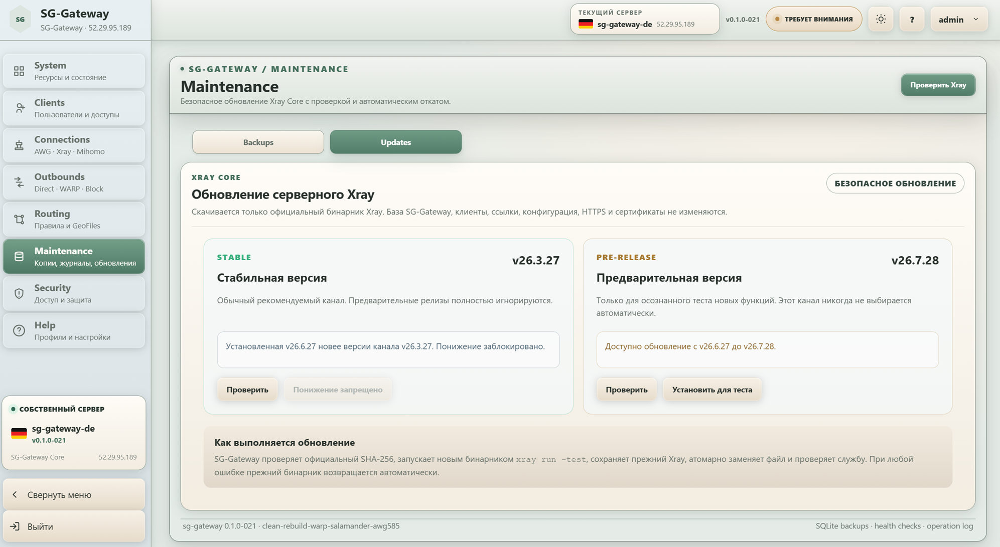
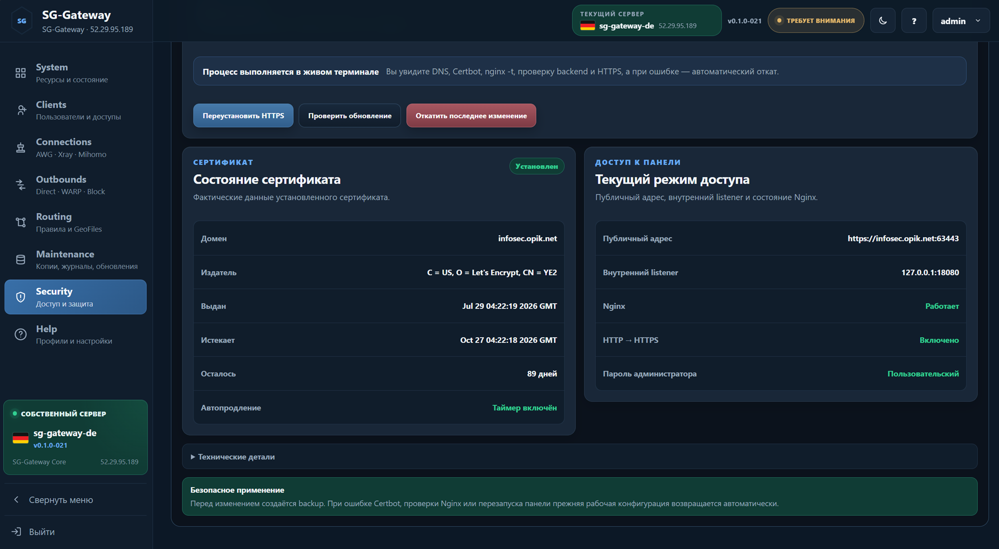

# Руководство пользователя SG-Gateway

Это краткий маршрут по панели в том же порядке, что и встроенная справка.

## System

Показывает ресурсы сервера, версии и состояние основных служб. С этой страницы удобно начинать проверку после установки или изменений.

## Clients

Клиент — логическая запись пользователя. Устройство — отдельный набор реквизитов доступа.

Рабочий порядок:

1. создать клиента;
2. добавить устройство;
3. выбрать доступные подключения;
4. применить изменения;
5. получить ссылку, QR-код, файл конфигурации или SG Client subscription;
6. при необходимости временно отключить устройство или клиента.

| Список клиентов | Карточка клиента |
| --- | --- |
|  |  |

| Добавление устройства | Выбор подключений |
| --- | --- |
|  |  |

## Connections

Здесь настраиваются серверные подключения AmneziaWG, Xray и дополнительные протоколы.

### Xray

Поддерживаются VLESS Reality TCP, VLESS XHTTP Reality, VLESS XHTTP TLS и Hysteria 2.

### AmneziaWG

AmneziaWG использует отдельный профиль сервера и индивидуальные реквизиты устройств.

### Mieru, AnyTLS и TUIC v5

Mieru обслуживается Mihomo, AnyTLS и TUIC v5 — sing-box.

## Outbounds

- `Direct` — выход через публичный IP сервера;
- `WARP` — выход через Cloudflare WARP;
- `Block` — блокировка трафика.

## Routing и GeoFiles

Routing назначает действие для доменов, IP и готовых категорий. GeoFiles всегда применяются связанной парой `geoip.dat` + `geosite.dat`.

Обычное обновление простое: **выберите источник → нажмите «Проверить источник» → после успешной проверки нажмите «Обновить GeoFiles»**. Вручную заменять файлы на сервере не нужно. SG-Gateway сам проверит категории и будущую конфигурацию Xray, сохранит резервную копию и выполнит безопасное переключение.

Подробная пошаговая инструкция с тремя реальными скриншотами — выбор и проверка источника, подтверждение обновления и результат — находится в [Routing и GeoFiles](ROUTING.md).

## Maintenance

Здесь находятся резервные копии, журналы, диагностика и независимые обновления панели и runtime-компонентов.

| Maintenance | Обновления |
| --- | --- |
|  |  |

## Security

Раздел отвечает за режим доступа к панели, домен и сертификат Let’s Encrypt.

| Security | Сертификат |
| --- | --- |
|  |  |

## Help

Встроенная справка повторяет структуру панели и даёт короткие инструкции по типовым операциям.

